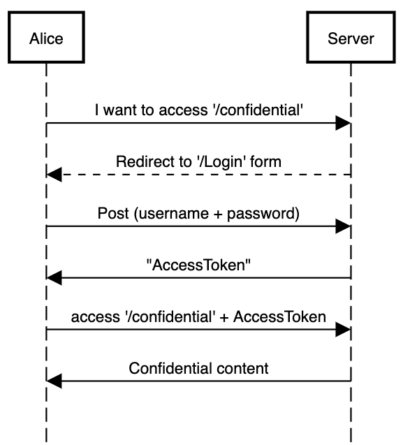
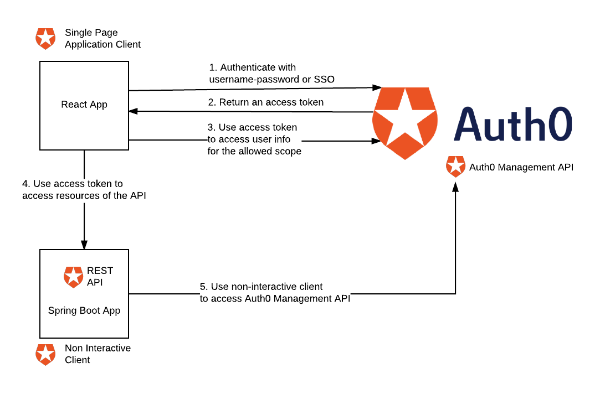

## Terminology

### `Authentication`

Verifying that a user is who he states he is (password)

### `Authorization`

Verifying that the user is allowed to view and perform operations

---

## Authentication



---

## Authentication tokens

- Cookie
- Bearer Authentication (token authentication)

---


---

## JWT - `J`SON `W`eb `T`oken

A token standard containing 3 sections:


```json
Header
{
 "alg" : "HS256",
 "typ" : "JWT"
}

Payload
{
 "loggedInAs" : "admin",
 "iat" : 1422779638
}

Signature:
HMAC-SHA256(
 base64urlEncoding(header) + '.' +
 base64urlEncoding(payload),
 secret
)
```
 
---

## JWT

```js
const token = base64urlEncoding(header) + '.' + 
              base64urlEncoding(payload) + '.' + 
              base64urlEncoding(signature)
```

Example Token
```sh
eyJhbGciOiJIUzI1NiIsInR5cCI6IkpXVCJ9.
eyJsb2dnZWRJbkFzIjoiYWRtaW4iLCJpYXQiOjE0MjI3Nzk2Mzh9.
gzSraSYS8EXBxLN_oWnFSRgCzcmJmMjLiuyu5CSpyHI
```
[jwt.io](https://jwt.io/)


---

# Token Passing

As an HTTP header:

`Authorization: Bearer eyJhbGci...<snip>...yu5CSpyH`

---

## Login Flow with SSO

1. If the resource requires Authorization resirect to Login page / widget
2. Choose SSO provider (Google / Facebook / Github etc.)
3. Login with provider
4. Provider redirects to a "callback" route with a token
5. Store the token in the app
6. Pass the token to server
7. Check token validity

----

## Adding Authentication to A Web App

The app needs to allow users to:

1. Login
2. Logout
3. Provide meta information about the user
4. Check if the is authenticated at any given moment

---

# Auth0

---

## Why use a 3rd party provider

1. Reliability
2. Cheap
3. Quick

---

## Getting Started with Auth0

1. Sign up @ [Auth0.com](https://auth0.com)
2. Create a new Application [in the dashboard](https://manage.auth0.com/dashboard)
3. Set the callbackurl to `http://localhost:3000`

---

# Let's secure an App

---



---

## Connecting to our WebApp

(inspired by [official react quickstart](https://auth0.com/docs/quickstart/spa/react))

```
npm install @auth0/auth0-spa-js

# or 

npm install @auth0/auth0-spa-js
```

---

## create `utils/history.ts`

```js
import { createBrowserHistory } from 'history';
export default createBrowserHistory();
```

----

## Auth0 wrapper

```js
// src/react-auth0-spa.tsx
import React, { useState, useEffect, useContext } from 'react';
import createAuth0Client from '@auth0/auth0-spa-js';

const DEFAULT_REDIRECT_CALLBACK = (state?) =>
    window.history.replaceState({}, document.title, window.location.pathname);

export const Auth0Context = React.createContext({});

export const useAuth0 = () => useContext(Auth0Context);
export const Auth0Provider = ({
    children,
    onRedirectCallback = DEFAULT_REDIRECT_CALLBACK,
    ...initOptions
}) => {
    const [isAuthenticated, setIsAuthenticated] = useState();
    const [user, setUser] = useState();
    const [auth0Client, setAuth0] = useState();
    const [loading, setLoading] = useState(true);
    const [popupOpen, setPopupOpen] = useState(false);

    useEffect(() => {
        const initAuth0 = async () => {
            const auth0FromHook = await createAuth0Client(initOptions as Auth0ClientOptions);
            setAuth0(auth0FromHook);

            if (
                window.location.search.includes('code=') &&
                window.location.search.includes('state=')
            ) {
                const {
                    appState,
                } = await auth0FromHook.handleRedirectCallback();
                onRedirectCallback(appState);
            }

            const isAuthenticated = await auth0FromHook.isAuthenticated();

            setIsAuthenticated(isAuthenticated);

            if (isAuthenticated) {
                const user = await auth0FromHook.getUser();
                setUser(user);
            }

            setLoading(false);
        };
        initAuth0();
        // eslint-disable-next-line
    }, []);

    const loginWithPopup = async (params = {}) => {
        setPopupOpen(true);
        try {
            await auth0Client.loginWithPopup(params);
        } catch (error) {
            console.error(error);
        } finally {
            setPopupOpen(false);
        }
        const user = await auth0Client.getUser();
        setUser(user);
        setIsAuthenticated(true);
    };

    const handleRedirectCallback = async () => {
        setLoading(true);
        await auth0Client.handleRedirectCallback();
        const user = await auth0Client.getUser();
        setLoading(false);
        setIsAuthenticated(true);
        setUser(user);
    };
    return (
        <Auth0Context.Provider
            value={{
                isAuthenticated,
                user,
                loading,
                popupOpen,
                loginWithPopup,
                handleRedirectCallback,
                getIdTokenClaims: (...p) => auth0Client.getIdTokenClaims(...p),
                loginWithRedirect: (...p) =>
                    auth0Client.loginWithRedirect(...p),
                getTokenSilently: (...p) => auth0Client.getTokenSilently(...p),
                getTokenWithPopup: (...p) =>
                    auth0Client.getTokenWithPopup(...p),
                logout: (...p) => auth0Client.logout(...p),
            }}
        >
            {children}
        </Auth0Context.Provider>
    );
};

```

---

## Update the header component

```js
import React, { ReactElement, ChangeEvent } from 'react';
import './header.css';
import { useAuth0 } from '../../react-auth0-spa';

interface Props {
    q: string;
    handleSearchChange(q: ChangeEvent<HTMLInputElement>): void;
}

export default function Header({ q, handleSearchChange }: Props): ReactElement {
    const { isAuthenticated, loginWithRedirect, logout, user } = useAuth0();

    return (
        <div>
            <nav>
                <div>{user && <div>Hi {user.nickname}</div>}</div>
                {!isAuthenticated && (
                    <button onClick={() => loginWithRedirect()}>Log in</button>
                )}
                {isAuthenticated && (
                    <button onClick={() => logout()}>Log out</button>
                )}
            </nav>
            <div className="header">
                <input
                    type="search"
                    placeholder="Search"
                    value={q}
                    onChange={handleSearchChange}
                />
            </div>
        </div>
    );
}

```
----

## Lets limit a specific route (PrivateRoute HoC)

```js
// src/components/PrivateRoute.tsx

import React, { useEffect } from 'react';
import { Route } from 'react-router-dom';
import { useAuth0 } from '../react-auth0-spa';

const PrivateRoute = ({ component: WrappedComponent, path, ...rest }) => {
    const { loading, isAuthenticated, loginWithRedirect } = useAuth0();
    const hash = window.location.hash;

    useEffect(() => {
        if (loading || isAuthenticated) {
            return;
        }
        const fn = async () => {
            console.log();
            debugger;
            await loginWithRedirect({
                appState: { targetUrl: hash },
            });
        };
        fn();
    }, [loading, isAuthenticated, loginWithRedirect, hash]);

    const render = props =>
        isAuthenticated === true ? <WrappedComponent {...props} /> : null;

    return <Route path={path} render={render} {...rest} />;
};

export default PrivateRoute;

```

---

## Now wrap any private route with `PrivateRoute` component

```js
// src/components/PrivateRoute.tsx
<PrivateRoute path="/show/:id" component={Show} />
<PrivateRoute path="/person/:id" component={Person} />

```

---

# Authorization

### After defining Who the user is - Descide what she can DO...

---


---

> Remember - Role is a "metadata" ontop from the "authentication" token

---

## Adding a Auth0 `Rule`

[New Rule](https://manage.auth0.com/dashboard/eu/tikalk/rules/new)

---

## Rule for adding role

```js
function (user, context, callback) {

  // Roles should only be set to verified users.
  if (!user.email || !user.email_verified) {
    return callback(null, user, context);
  }

  user.app_metadata = user.app_metadata || {};
  // You can add a Role based on what you want
  // In this case I check domain
  const addRolesToUser = function (user) {
    const endsWith = '@tikalk.com';
		if (user.email === 'assaf@tikalk.com') {
      return ['admin'];
    }
    if (user.email && (user.email.substring(user.email.length - endsWith.length, user.email.length) === endsWith)) {
      return ['user'];
    }
    return [];
  };

  const roles = addRolesToUser(user);

  user.app_metadata.roles = roles;
  
  console.log('user', user);
  
  auth0.users.updateAppMetadata(user.user_id, user.app_metadata)
    .then(function () {
      context.idToken['https://shows.tikalk.com/roles'] = user.app_metadata.roles;
      callback(null, user, context);
    })
    .catch(function (err) {
      callback(err);
    });
}
```

---

## Use a hook

```js
import { useAuth0 } from "../react-auth0-spa";

export const useRole = (allowedRoles) => {
    const { user } = useAuth0();
    const userRoles = user['https://shows.tikalk.com/roles'];
    return userRoles.some(r=> allowedRoles.includes(r))
}
```

---

## Summary

- Authentication = Determining the user's `identity`
- Authorization = Determining the user's `privilages` (roles)
- Token-based auth is prefered since it supports stateless services
- There are many ways to implement authentication, Auth context is one of them 